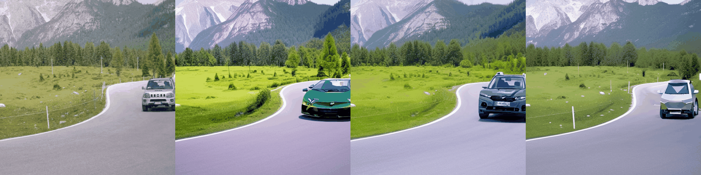

# STIVE (Stable Textual Inversion Video Editing)

<!-- <video src="assets/jeep-unet-full-supvis/concat.mp4"> </video> -->
<video autoplay loop muted playsinline>
    <source src="assets/jeep-unet-full-supvis/concat.mp4" type="video/mp4">
    Your browser does not support the video tag.
</video>
<!--  -->

## Get started
### Prepare Environment
* To create environment with conda:
    ```shell
    conda env create --file environment.yml
    conda activate stive
    ```
* or setup environment with pip whether in a conda environment or not:
    ```shell
    pip3 install -r requirements.txt
    ```

### Download Pretrained Models
* SD1.4 model from: [CompVis/stable-diffusion-v1-4](https://huggingface.co/CompVis/stable-diffusion-v1-4/tree/main) (necessary)
* clip model from: [openai/clip-vit-large-patch14](https://huggingface.co/openai/clip-vit-large-patch14/tree/main) (to evaluate clip and frame-consistency scores, not necessary)
* owlvit model from: [google/owlvit-base-patch16](https://huggingface.co/google/owlvit-base-patch16/tree/main) (to extract mask for attn-prob supervision)
* zeroscope model from: [cerspense/zeroscope_v2_576w](https://huggingface.co/cerspense/zeroscope_v2_576w/tree/main) (more efficent editing, recommend to download)

## Examples
<details>
<summary>Swap jeep to <code>$LAMBO</code></summary>

<ul>
<li>finetune concept from SD:
    <pre><code>CUDA_VISIBLE_DEVICES=0 accelerate launch runs/finetune_sd_concepts.py --config configs/sd_concepts/sd_lambo.yaml</code></pre>
</li>
<li>finetune SD with spatial&amp;temporal modules:
    <pre><code>CUDA_VISIBLE_DEVICES=0 accelerate launch runs/finetune_sd_unet.py --config configs/sd_unet/jeep_to_lambo.yaml</code></pre>
</li>
<li>prompt-to-prompt inference with concept and pretrained SD:
    <pre><code>CUDA_VISIBLE_DEVICES=0 accelerate launch runs/inference_sd_ptp.py --config configs/sd_ptp/lambo.yaml</code></pre>
</li>
<li>prompt-to-prompt inference with concept and tuned SD:
    <pre><code>CUDA_VISIBLE_DEVICES=0 accelerate launch runs/inference_lora_sd_ptp.py --config configs/sd_ptp/lambo.yaml</code></pre>
</li>

<li>finetune concept from ZS:
    <pre><code>CUDA_VISIBLE_DEVICES=0 accelerate launch runs/finetune_zs_concepts.py --config configs/zs_concepts/zs_lambo.yaml</code></pre>
</li>
<li>finetune ZS with spatial&amp;temporal modules:
    <pre><code>CUDA_VISIBLE_DEVICES=0 accelerate launch runs/finetune_zs_unet.py --config configs/zs_unet/jeep_to_lambo.yaml</code></pre>
</li>
<li>prompt-to-prompt inference with concept and pretrained ZS:
    <pre><code>CUDA_VISIBLE_DEVICES=0 accelerate launch runs/inference_zs_ptp.py --config configs/zs_ptp/lambo.yaml</code></pre>
</li>
<li>prompt-to-prompt inference with concept and tuned ZS:
    <pre><code>CUDA_VISIBLE_DEVICES=0 accelerate launch runs/inference_lora_zs_ptp.py --config configs/zs_ptp/lambo.yaml</code></pre>
</li>
</ul>

</details>

<details>
<summary>Swap jeep to <code>$CYBERTRUCK</code></summary>

<ul>
<li>finetune concept from SD:
    <pre><code>CUDA_VISIBLE_DEVICES=0 accelerate launch runs/finetune_sd_concepts.py --config configs/sd_concepts/sd_cybertruck.yaml</code></pre>
</li>
<li>finetune SD with spatial&amp;temporal modules:
    <pre><code>CUDA_VISIBLE_DEVICES=0 accelerate launch runs/finetune_sd_unet.py --config configs/sd_unet/jeep_to_cybertruck.yaml</code></pre>
</li>
<li>prompt-to-prompt inference with concept and pretrained SD:
    <pre><code>CUDA_VISIBLE_DEVICES=0 accelerate launch runs/inference_sd_ptp.py --config configs/sd_ptp/cybertruck.yaml</code></pre>
</li>
<li>prompt-to-prompt inference with concept and tuned SD:
    <pre><code>CUDA_VISIBLE_DEVICES=0 accelerate launch runs/inference_lora_sd_ptp.py --config configs/sd_ptp/cybertruck.yaml</code></pre>
</li>
</ul>

</details>

<details>
<summary>Swap jeep to <code>$FERRARI</code></summary>

<ul>
<li>finetune concept from SD:
    <pre><code>CUDA_VISIBLE_DEVICES=0 accelerate launch runs/finetune_sd_concepts.py --config configs/sd_concepts/sd_ferrari.yaml</code></pre>
</li>
<li>finetune SD with spatial&amp;temporal modules:
    <pre><code>CUDA_VISIBLE_DEVICES=0 accelerate launch runs/finetune_sd_unet.py --config configs/sd_unet/jeep_to_ferrari.yaml</code></pre>
</li>
<li>prompt-to-prompt inference with concept and pretrained SD:
    <pre><code>CUDA_VISIBLE_DEVICES=0 accelerate launch runs/inference_sd_ptp.py --config configs/sd_ptp/ferrari.yaml</code></pre>
</li>
<li>prompt-to-prompt inference with concept and tuned SD:
    <pre><code>CUDA_VISIBLE_DEVICES=0 accelerate launch runs/inference_lora_sd_ptp.py --config configs/sd_ptp/ferrari.yaml</code></pre>
</li>
</ul>

</details>

<details>
<summary>Swap jeep to <code>$BMW</code></summary>

<ul>
<li>finetune concept from SD:
    <pre><code>CUDA_VISIBLE_DEVICES=0 accelerate launch runs/finetune_sd_concepts.py --config configs/sd_concepts/sd_bmw.yaml</code></pre>
</li>
<li>finetune SD with spatial&amp;temporal modules:
    <pre><code>CUDA_VISIBLE_DEVICES=0 accelerate launch runs/finetune_sd_unet.py --config configs/sd_unet/jeep_to_bmw.yaml</code></pre>
</li>
<li>prompt-to-prompt inference with concept and pretrained SD:
    <pre><code>CUDA_VISIBLE_DEVICES=0 accelerate launch runs/inference_sd_ptp.py --config configs/sd_ptp/bmw.yaml</code></pre>
</li>
<li>prompt-to-prompt inference with concept and tuned SD:
    <pre><code>CUDA_VISIBLE_DEVICES=0 accelerate launch runs/inference_lora_sd_ptp.py --config configs/sd_ptp/bmw.yaml</code></pre>
</li>
</ul>

</details>
