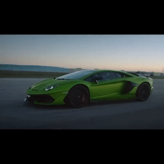
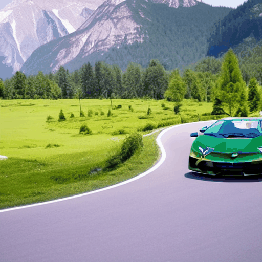
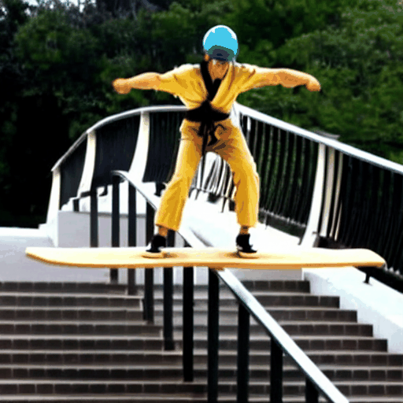
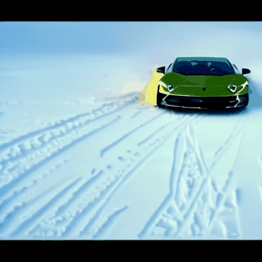
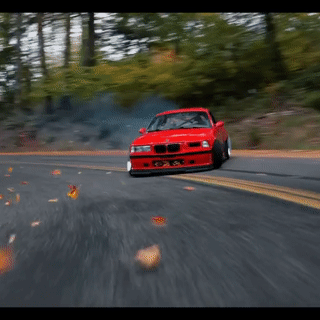
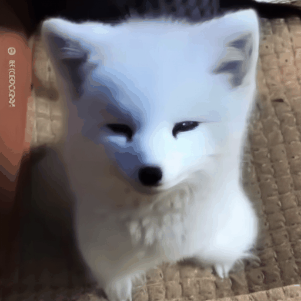
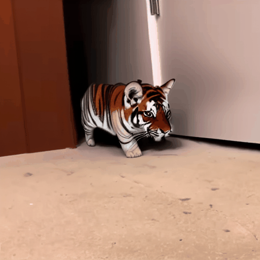

# Shaping a Stabilized Video by Mitigating Unintended Changes for Concept-Augmented Video Editing


## Get started
### Prepare Environment
* To create environment with conda:
    ```sh
    conda env create --file environment.yml
    conda activate stive
    ```
* or setup environment with pip whether in a conda environment or not:
    ```shell
    pip3 install -r requirements.txt
    ```

### Download Pretrained Models
* SD1.4 model from: [CompVis/stable-diffusion-v1-4](https://huggingface.co/CompVis/stable-diffusion-v1-4/tree/main) (necessary)
* clip model from: [openai/clip-vit-large-patch14](https://huggingface.co/openai/clip-vit-large-patch14/tree/main) (to evaluate clip and frame-consistency scores, not necessary)
* owlvit model from: [google/owlvit-base-patch16](https://huggingface.co/google/owlvit-base-patch16/tree/main) (to extract mask for attn-prob supervision, necessary for custom data)

## Examples

<table style="width:100%; border-collapse: collapse;">
  <tr>
    <th style="border: 1px solid black; padding: 10px;">Source Video</th>
    <th style="border: 1px solid black; padding: 10px;">Concept Video</th>
    <th style="border: 1px solid black; padding: 10px;">Target Video</th>
    <th style="border: 1px solid black; padding: 10px;">Target Prompt</th>
  </tr>
  <tr>
    <td style="border: 1px solid black; padding: 10px;">
        
    </td>
    <td style="border: 1px solid black; padding: 10px;">
        
    </td>
    <td style="border: 1px solid black; padding: 10px;">
        
    </td>
    <td style="border: 1px solid black; padding: 10px;">
      <a href="#jeep">a $LAMBO driving down a curvy road in the countryside</a>
    </td>
  </tr>
  <tr>
    <td style="border: 1px solid black; padding: 10px;">
        
    </td>
    <td style="border: 1px solid black; padding: 10px;">
        
    </td>
    <td style="border: 1px solid black; padding: 10px;">
        
    </td>
    <td style="border: 1px solid black; padding: 10px;">
      <a href="#jeep">a $BMW driving down a curvy road in the countryside</a>
    </td>
  </tr>
    <tr>
    <td style="border: 1px solid black; padding: 10px;">
        
    </td>
    <td style="border: 1px solid black; padding: 10px;">
        
    </td>
    <td style="border: 1px solid black; padding: 10px;">
        
    </td>
    <td style="border: 1px solid black; padding: 10px;">
      <a href="#jeep">a $MERCEDES driving down a curvy road in the countryside</a>
    </td>
  </tr>
  <tr>
    <td style="border: 1px solid black; padding: 10px;">
        
    </td>
    <td style="border: 1px solid black; padding: 10px;">
        
    </td>
    <td style="border: 1px solid black; padding: 10px;">
        
    </td>
    <td style="border: 1px solid black; padding: 10px;">
      <a href="#jeep">a $CYBERTRUCK driving down a curvy road in the countryside</a>
    </td>
  </tr>
    <tr>
    <td style="border: 1px solid black; padding: 10px;">
        
    </td>
    <td style="border: 1px solid black; padding: 10px;">
        <div style="text-align: center;">No Concept Video</text>
    </td>
    <td style="border: 1px solid black; padding: 10px;">
        
    </td>
    <td style="border: 1px solid black; padding: 10px;">
      <a href="#jeep">a porsche driving down a curvy road in the countryside</a>
    </td>
  </tr>
    <tr>
    <td style="border: 1px solid black; padding: 10px;">
        
    </td>
    <td style="border: 1px solid black; padding: 10px;">
        
    </td>
    <td style="border: 1px solid black; padding: 10px;">
        
    </td>
    <td style="border: 1px solid black; padding: 10px;">
      <a href="#man-skate">a $OPTIMUS rides a wooden skateboard on the handrail of the staircase with arms outstretched</a>
    </td>
  </tr>
    <tr>
    <td style="border: 1px solid black; padding: 10px;">
        
    </td>
    <td style="border: 1px solid black; padding: 10px;">
        
    </td>
    <td style="border: 1px solid black; padding: 10px;">
        
    </td>
    <td style="border: 1px solid black; padding: 10px;">
      <a href="#man-skate">a $NEO rides a wooden skateboard on the handrail of the staircase with arms outstretched</a>
    </td>
  </tr>
    <tr>
    <td style="border: 1px solid black; padding: 10px;">
        
    </td>
    <td style="border: 1px solid black; padding: 10px;">
        
    </td>
    <td style="border: 1px solid black; padding: 10px;">
        
    </td>
    <td style="border: 1px solid black; padding: 10px;">
      <a href="#man-skate">a $ULTRON rides a wooden skateboard on the handrail of the staircase with arms outstretched</a>
    </td>
  </tr>
    <tr>
    <td style="border: 1px solid black; padding: 10px;">
        
    </td>
    <td style="border: 1px solid black; padding: 10px;">
        
    </td>
    <td style="border: 1px solid black; padding: 10px;">
        
    </td>
    <td style="border: 1px solid black; padding: 10px;">
      <a href="#tesla">a $FERRARI is drifting in the snow</a>
    </td>
  </tr>
    <tr>
    <td style="border: 1px solid black; padding: 10px;">
        
    </td>
    <td style="border: 1px solid black; padding: 10px;">
        
    </td>
    <td style="border: 1px solid black; padding: 10px;">
        
    </td>
    <td style="border: 1px solid black; padding: 10px;">
      <a href="#tesla">a $LAMBO is drifting in the snow</a>
    </td>
  </tr>
    <tr>
    <td style="border: 1px solid black; padding: 10px;">
        
    </td>
    <td style="border: 1px solid black; padding: 10px;">
        
    </td>
    <td style="border: 1px solid black; padding: 10px;">
        
    </td>
    <td style="border: 1px solid black; padding: 10px;">
      <a href="#car-drift">a $FERRARI is drifting around a curve road with the background of a forest</a>
    </td>
  </tr>
    <tr>
    <td style="border: 1px solid black; padding: 10px;">
        
    </td>
    <td style="border: 1px solid black; padding: 10px;">
        
    </td>
    <td style="border: 1px solid black; padding: 10px;">
        
    </td>
    <td style="border: 1px solid black; padding: 10px;">
      <a href="#car-drift">a $GT3 is drifting around a curve road with the background of a forest</a>
    </td>
  </tr>
    <tr>
    <td style="border: 1px solid black; padding: 10px;">
        
    </td>
    <td style="border: 1px solid black; padding: 10px;">
        
    </td>
    <td style="border: 1px solid black; padding: 10px;">
        
    </td>
    <td style="border: 1px solid black; padding: 10px;">
      <a href="#gray-dog">a $CAT sitting on a mat</a>
    </td>
  </tr>
    <tr>
    <td style="border: 1px solid black; padding: 10px;">
        
    </td>
    <td style="border: 1px solid black; padding: 10px;">
        
    </td>
    <td style="border: 1px solid black; padding: 10px;">
        
    </td>
    <td style="border: 1px solid black; padding: 10px;">
      <a href="#gray-dog">a $FOX sitting on a mat</a>
    </td>
  </tr>
    <tr>
    <td style="border: 1px solid black; padding: 10px;">
        
    </td>
    <td style="border: 1px solid black; padding: 10px;">
        <div style="text-align: center;">No Concept Video</text>
    </td>
    <td style="border: 1px solid black; padding: 10px;">
        
    </td>
    <td style="border: 1px solid black; padding: 10px;">
      <a href="#kitten">a red tiger walking on the floor next to a wall</a>
    </td>
  </tr>
    <tr>
    <td style="border: 1px solid black; padding: 10px;">
        
    </td>
    <td style="border: 1px solid black; padding: 10px;">
        
    </td>
    <td style="border: 1px solid black; padding: 10px;">
        
    </td>
    <td style="border: 1px solid black; padding: 10px;">
      <a href="#swan">a $MALLARD swimming in a river near a wall and bushes</a>
    </td>
  </tr>
    <tr>
    <td style="border: 1px solid black; padding: 10px;">
        
    </td>
    <td style="border: 1px solid black; padding: 10px;">
        
    </td>
    <td style="border: 1px solid black; padding: 10px;">
        
    </td>
    <td style="border: 1px solid black; padding: 10px;">
      <a href="#swan">a $PELICAN swimming in a river near a wall and bushes</a>
    </td>
  </tr>
    <!-- <tr>
    <td style="border: 1px solid black; padding: 10px;">
        
    </td>
    <td style="border: 1px solid black; padding: 10px;">
        <div style="text-align: center;">No Concept Video</text>
    </td>
    <td style="border: 1px solid black; padding: 10px;">
        
    </td>
    <td style="border: 1px solid black; padding: 10px;">
      <a href="#swan">a pink flamingo swimming in a river near a wall and bushes</a>
    </td>
  </tr> -->
</table>

> For devices with less than 100 GB of RAM, we recommend using the `runs/inference_lora_sd_ptp_ms.py` script instead of the `runs/inference_lora_sd_ptp.py` script for inference, which can achieve almost identical results.

### jeep
<details>
<summary>Swap jeep to <code>$LAMBO</code></summary>

<ul>
<li>finetune concept from SD:
    <pre><code>CUDA_VISIBLE_DEVICES=0 accelerate launch runs/finetune_sd_concepts.py --config configs/sd_concepts/sd_lambo.yaml</code></pre>
</li>
<li>finetune SD with spatial&amp;temporal modules:
    <pre><code>CUDA_VISIBLE_DEVICES=0 accelerate launch runs/finetune_sd_unet.py --config configs/sd_unet/car-turn/jeep_to_lambo.yaml</code></pre>
</li>
<li>prompt-to-prompt inference with concept and pretrained SD:
    <pre><code>CUDA_VISIBLE_DEVICES=0 accelerate launch runs/inference_sd_ptp.py --config configs/sd_ptp/car-turn/lambo.yaml</code></pre>
</li>
<li>prompt-to-prompt inference with concept and tuned SD:
    <pre><code>CUDA_VISIBLE_DEVICES=0 accelerate launch runs/inference_lora_sd_ptp.py --config configs/sd_ptp/car-turn/lambo.yaml</code></pre>
</li>
</ul>

</details>

<details>
<summary>Swap jeep to <code>$CYBERTRUCK</code></summary>

<ul>
<li>finetune concept from SD:
    <pre><code>CUDA_VISIBLE_DEVICES=0 accelerate launch runs/finetune_sd_concepts.py --config configs/sd_concepts/sd_cybertruck.yaml</code></pre>
</li>
<li>finetune SD with spatial&amp;temporal modules:
    <pre><code>CUDA_VISIBLE_DEVICES=0 accelerate launch runs/finetune_sd_unet.py --config configs/sd_unet/car-turn/jeep_to_cybertruck.yaml</code></pre>
</li>
<li>prompt-to-prompt inference with concept and pretrained SD:
    <pre><code>CUDA_VISIBLE_DEVICES=0 accelerate launch runs/inference_sd_ptp.py --config configs/sd_ptp/car-turn/cybertruck.yaml</code></pre>
</li>
<li>prompt-to-prompt inference with concept and tuned SD:
    <pre><code>CUDA_VISIBLE_DEVICES=0 accelerate launch runs/inference_lora_sd_ptp.py --config configs/sd_ptp/car-turn/cybertruck.yaml</code></pre>
</li>
</ul>

</details>


<details>
<summary>Swap jeep to <code>$BMW</code></summary>

<ul>
<li>finetune concept from SD:
    <pre><code>CUDA_VISIBLE_DEVICES=0 accelerate launch runs/finetune_sd_concepts.py --config configs/sd_concepts/sd_bmw.yaml</code></pre>
</li>
<li>finetune SD with spatial&amp;temporal modules:
    <pre><code>CUDA_VISIBLE_DEVICES=0 accelerate launch runs/finetune_sd_unet.py --config configs/sd_unet/car-turn/jeep_to_bmw.yaml</code></pre>
</li>
<li>prompt-to-prompt inference with concept and pretrained SD:
    <pre><code>CUDA_VISIBLE_DEVICES=0 accelerate launch runs/inference_sd_ptp.py --config configs/sd_ptp/car-turn/bmw.yaml</code></pre>
</li>
<li>prompt-to-prompt inference with concept and tuned SD:
    <pre><code>CUDA_VISIBLE_DEVICES=0 accelerate launch runs/inference_lora_sd_ptp.py --config configs/sd_ptp/car-turn/bmw.yaml</code></pre>
</li>
</ul>

</details>

<details>
<summary>Swap jeep to <code>$GT3</code></summary>

<ul>
<li>finetune concept from SD:
    <pre><code>CUDA_VISIBLE_DEVICES=0 accelerate launch runs/finetune_sd_concepts.py --config configs/sd_concepts/sd_gt3.yaml</code></pre>
</li>
<li>finetune SD with spatial&amp;temporal modules:
    <pre><code>CUDA_VISIBLE_DEVICES=0 accelerate launch runs/finetune_sd_unet.py --config configs/sd_unet/car-turn/jeep_to_gt3.yaml</code></pre>
</li>
<li>prompt-to-prompt inference with concept and pretrained SD:
    <pre><code>CUDA_VISIBLE_DEVICES=0 accelerate launch runs/inference_sd_ptp.py --config configs/sd_ptp/car-turn/gt3.yaml</code></pre>
</li>
<li>prompt-to-prompt inference with concept and tuned SD:
    <pre><code>CUDA_VISIBLE_DEVICES=0 accelerate launch runs/inference_lora_sd_ptp.py --config configs/sd_ptp/car-turn/gt3.yaml</code></pre>
</li>
</ul>
</details>

<details>
<summary>Swap jeep to <code>$MERCEDES</code></summary>

<ul>
<li>finetune concept from SD:
    <pre><code>CUDA_VISIBLE_DEVICES=0 accelerate launch runs/finetune_sd_concepts.py --config configs/sd_concepts/sd_mercedes.yaml</code></pre>
</li>
<li>finetune SD with spatial&amp;temporal modules:
    <pre><code>CUDA_VISIBLE_DEVICES=0 accelerate launch runs/finetune_sd_unet.py --config configs/sd_unet/car-turn/jeep_to_mercedes.yaml</code></pre>
</li>
<li>prompt-to-prompt inference with concept and pretrained SD:
    <pre><code>CUDA_VISIBLE_DEVICES=0 accelerate launch runs/inference_sd_ptp.py --config configs/sd_ptp/car-turn/mercedes.yaml</code></pre>
</li>
<li>prompt-to-prompt inference with concept and tuned SD:
    <pre><code>CUDA_VISIBLE_DEVICES=0 accelerate launch runs/inference_lora_sd_ptp.py --config configs/sd_ptp/car-turn/mercedes.yaml</code></pre>
</li>
</ul>
</details>

<details>
<summary>Swap jeep to <code>porsche</code></summary>
<ul>
<li>finetune SD with spatial&amp;temporal modules:
    <pre><code>CUDA_VISIBLE_DEVICES=0 accelerate launch runs/finetune_sd_unet.py --config configs/sd_unet/car-turn/jeep_to_porsche.yaml</code></pre>
</li>
<li>prompt-to-prompt inference with concept and tuned SD:
    <pre><code>CUDA_VISIBLE_DEVICES=0 accelerate launch runs/inference_lora_sd_ptp.py --config configs/sd_ptp/car-turn/porsche.yaml</code></pre>
</li>
</ul>
</details>

### tesla
<details>
<summary>Swap tesla to <code>$FERRARI</code></summary>
<ul>
<li>finetune concept from SD:
    <pre><code>CUDA_VISIBLE_DEVICES=0 accelerate launch runs/finetune_sd_concepts.py --config configs/sd_concepts/sd_ferrari.yaml</code></pre>
</li>
<li>finetune SD with spatial&amp;temporal modules:
    <pre><code>CUDA_VISIBLE_DEVICES=0 accelerate launch runs/finetune_sd_unet.py --config configs/sd_unet/tesla/tesla_to_ferrari.yaml</code></pre>
</li>
<li>prompt-to-prompt inference with concept and pretrained SD:
    <pre><code>CUDA_VISIBLE_DEVICES=0 accelerate launch runs/inference_sd_ptp.py --config configs/sd_ptp/tesla/ferrari.yaml</code></pre>
</li>
<li>prompt-to-prompt inference with concept and tuned SD:
    <pre><code>CUDA_VISIBLE_DEVICES=0 accelerate launch runs/inference_lora_sd_ptp.py --config configs/sd_ptp/tesla/ferrari.yaml</code></pre>
</li>
</ul>
</details>

<details>
<summary>Swap tesla to <code>$LAMBO</code></summary>
<ul>
<li>finetune concept from SD:
    <pre><code>CUDA_VISIBLE_DEVICES=0 accelerate launch runs/finetune_sd_concepts.py --config configs/sd_concepts/sd_lambo.yaml</code></pre>
</li>
<li>finetune SD with spatial&amp;temporal modules:
    <pre><code>CUDA_VISIBLE_DEVICES=0 accelerate launch runs/finetune_sd_unet.py --config configs/sd_unet/tesla/tesla_to_lambo.yaml</code></pre>
</li>
<li>prompt-to-prompt inference with concept and pretrained SD:
    <pre><code>CUDA_VISIBLE_DEVICES=0 accelerate launch runs/inference_sd_ptp.py --config configs/sd_ptp/tesla/lambo.yaml</code></pre>
</li>
<li>prompt-to-prompt inference with concept and tuned SD:
    <pre><code>CUDA_VISIBLE_DEVICES=0 accelerate launch runs/inference_lora_sd_ptp.py --config configs/sd_ptp/tesla/lambo.yaml</code></pre>
</li>
</ul>
</details>


### car-drift

<details>
<summary>Swap car to <code>$GT3</code></summary>
<ul>
<li>finetune concept from SD:
    <pre><code>CUDA_VISIBLE_DEVICES=0 accelerate launch runs/finetune_sd_concepts.py --config configs/sd_concepts/sd_gt3.yaml</code></pre>
</li>
<li>finetune SD with spatial&amp;temporal modules:
    <pre><code>CUDA_VISIBLE_DEVICES=0 accelerate launch runs/finetune_sd_unet.py --config configs/sd_unet/car-drift/car_to_gt3.yaml</code></pre>
</li>
<li>prompt-to-prompt inference with concept and pretrained SD:
    <pre><code>CUDA_VISIBLE_DEVICES=0 accelerate launch runs/inference_sd_ptp.py --config configs/sd_ptp/car-drift/gt3.yaml</code></pre>
</li>
<li>prompt-to-prompt inference with concept and tuned SD:
    <pre><code>CUDA_VISIBLE_DEVICES=0 accelerate launch runs/inference_lora_sd_ptp.py --config configs/sd_ptp/car-drift/gt3.yaml</code></pre>
</li>
</ul>
</details>

<details>
<summary>Swap car to <code>$FERRARI</code></summary>
<ul>
<li>finetune concept from SD:
    <pre><code>CUDA_VISIBLE_DEVICES=0 accelerate launch runs/finetune_sd_concepts.py --config configs/sd_concepts/sd_ferrari.yaml</code></pre>
</li>
<li>finetune SD with spatial&amp;temporal modules:
    <pre><code>CUDA_VISIBLE_DEVICES=0 accelerate launch runs/finetune_sd_unet.py --config configs/sd_unet/car-drift/car_to_ferrari.yaml</code></pre>
</li>
<li>prompt-to-prompt inference with concept and pretrained SD:
    <pre><code>CUDA_VISIBLE_DEVICES=0 accelerate launch runs/inference_sd_ptp.py --config configs/sd_ptp/car-drift/ferrari.yaml</code></pre>
</li>
<li>prompt-to-prompt inference with concept and tuned SD:
    <pre><code>CUDA_VISIBLE_DEVICES=0 accelerate launch runs/inference_lora_sd_ptp.py --config configs/sd_ptp/car-drift/ferrari.yaml</code></pre>
</li>
</ul>
</details>

### lotus
<details>
<summary>Swap lotus to <code>$CHRYSANTHEMUM</code></summary>

<ul>
<li>finetune concept from SD:
    <pre><code>CUDA_VISIBLE_DEVICES=0 accelerate launch runs/finetune_sd_concepts.py --config configs/sd_concepts/sd_chrysanthemum.yaml</code></pre>
</li>
<li>finetune SD with spatial&amp;temporal modules:
    <pre><code>CUDA_VISIBLE_DEVICES=0 accelerate launch runs/finetune_sd_unet.py --config configs/sd_unet/lotus/lotus_to_chrysanthemum.yaml</code></pre>
</li>
<li>prompt-to-prompt inference with concept and pretrained SD:
    <pre><code>CUDA_VISIBLE_DEVICES=0 accelerate launch runs/inference_sd_ptp.py --config configs/sd_ptp/lotus/chrysanthemum.yaml</code></pre>
</li>
<li>prompt-to-prompt inference with concept and tuned SD:
    <pre><code>CUDA_VISIBLE_DEVICES=0 accelerate launch runs/inference_lora_sd_ptp.py --config configs/sd_ptp/lotus/chrysanthemum.yaml</code></pre>
</li>
</ul>
</details>

### rain-lotus
<details>
<summary>Swap rain-lotus to <code>$CHRYSANTHEMUM</code></summary>

<ul>
<li>finetune concept from SD:
    <pre><code>CUDA_VISIBLE_DEVICES=0 accelerate launch runs/finetune_sd_concepts.py --config configs/sd_concepts/sd_chrysanthemum.yaml</code></pre>
</li>
<li>finetune SD with spatial&amp;temporal modules:
    <pre><code>CUDA_VISIBLE_DEVICES=0 accelerate launch runs/finetune_sd_unet.py --config configs/sd_unet/rain-lotus/lotus_to_chrysanthemum.yaml</code></pre>
</li>
<li>prompt-to-prompt inference with concept and pretrained SD:
    <pre><code>CUDA_VISIBLE_DEVICES=0 accelerate launch runs/inference_sd_ptp.py --config configs/sd_ptp/rain-lotus/chrysanthemum.yaml</code></pre>
</li>
<li>prompt-to-prompt inference with concept and tuned SD:
    <pre><code>CUDA_VISIBLE_DEVICES=0 accelerate launch runs/inference_lora_sd_ptp.py --config configs/sd_ptp/rain-lotus/chrysanthemum.yaml</code></pre>
</li>
</ul>
</details>

### man-skate
<details>
<summary>Swap man to <code>$NEO</code></summary>
<ul>
<li>finetune concept from SD:
    <pre><code>CUDA_VISIBLE_DEVICES=0 accelerate launch runs/finetune_sd_concepts.py --config configs/sd_concepts/sd_neo.yaml</code></pre>
</li>
<li>finetune SD with spatial&amp;temporal modules:
    <pre><code>CUDA_VISIBLE_DEVICES=0 accelerate launch runs/finetune_sd_unet.py --config configs/sd_unet/man-skate/man_to_neo.yaml</code></pre>
</li>
<li>prompt-to-prompt inference with concept and pretrained SD:
    <pre><code>CUDA_VISIBLE_DEVICES=0 accelerate launch runs/inference_sd_ptp.py --config configs/sd_ptp/man-skate/neo.yaml</code></pre>
</li>
<li>prompt-to-prompt inference with concept and tuned SD:
    <pre><code>CUDA_VISIBLE_DEVICES=0 accelerate launch runs/inference_lora_sd_ptp.py --config configs/sd_ptp/man-skate/neo.yaml</code></pre>
</li>
</ul>
</details>


<details>
<summary>Swap man to <code>$OPTIMUS</code></summary>
<ul>
<li>finetune concept from SD:
    <pre><code>CUDA_VISIBLE_DEVICES=0 accelerate launch runs/finetune_sd_concepts.py --config configs/sd_concepts/sd_optimus.yaml</code></pre>
</li>
<li>finetune SD with spatial&amp;temporal modules:
    <pre><code>CUDA_VISIBLE_DEVICES=0 accelerate launch runs/finetune_sd_unet.py --config configs/sd_unet/man-skate/man_to_optimus.yaml</code></pre>
</li>
<li>prompt-to-prompt inference with concept and pretrained SD:
    <pre><code>CUDA_VISIBLE_DEVICES=0 accelerate launch runs/inference_sd_ptp.py --config configs/sd_ptp/man-skate/optimus.yaml</code></pre>
</li>
<li>prompt-to-prompt inference with concept and tuned SD:
    <pre><code>CUDA_VISIBLE_DEVICES=0 accelerate launch runs/inference_lora_sd_ptp.py --config configs/sd_ptp/man-skate/optimus.yaml</code></pre>
</li>
</ul>
</details>


<details>
<summary>Swap man to <code>$ULTRON</code></summary>
<ul>
<li>finetune concept from SD:
    <pre><code>CUDA_VISIBLE_DEVICES=0 accelerate launch runs/finetune_sd_concepts.py --config configs/sd_concepts/sd_ultron.yaml</code></pre>
</li>
<li>finetune SD with spatial&amp;temporal modules:
    <pre><code>CUDA_VISIBLE_DEVICES=0 accelerate launch runs/finetune_sd_unet.py --config configs/sd_unet/man-skate/man_to_ultron.yaml</code></pre>
</li>
<li>prompt-to-prompt inference with concept and pretrained SD:
    <pre><code>CUDA_VISIBLE_DEVICES=0 accelerate launch runs/inference_sd_ptp.py --config configs/sd_ptp/man-skate/ultron.yaml</code></pre>
</li>
<li>prompt-to-prompt inference with concept and tuned SD:
    <pre><code>CUDA_VISIBLE_DEVICES=0 accelerate launch runs/inference_lora_sd_ptp.py --config configs/sd_ptp/man-skate/ultron.yaml</code></pre>
</li>
</ul>
</details>

### swan
<details>
<summary>Swap swan to <code>$MALLARD</code></summary>
<ul>
<li>finetune concept from SD:
    <pre><code>CUDA_VISIBLE_DEVICES=0 accelerate launch runs/finetune_sd_concepts.py --config configs/sd_concepts/sd_mallard.yaml</code></pre>
</li>
<li>finetune SD with spatial&amp;temporal modules:
    <pre><code>CUDA_VISIBLE_DEVICES=0 accelerate launch runs/finetune_sd_unet.py --config configs/sd_unet/swan/swan_to_mallard.yaml</code></pre>
</li>
<li>prompt-to-prompt inference with concept and pretrained SD:
    <pre><code>CUDA_VISIBLE_DEVICES=0 accelerate launch runs/inference_sd_ptp.py --config configs/sd_ptp/swan/mallard.yaml</code></pre>
</li>
<li>prompt-to-prompt inference with concept and tuned SD:
    <pre><code>CUDA_VISIBLE_DEVICES=0 accelerate launch runs/inference_lora_sd_ptp.py --config configs/sd_ptp/swan/mallard.yaml</code></pre>
</li>
</ul>
</details>


<details>
<summary>Swap swan to <code>$PELICAN</code></summary>
<ul>
<li>finetune concept from SD:
    <pre><code>CUDA_VISIBLE_DEVICES=0 accelerate launch runs/finetune_sd_concepts.py --config configs/sd_concepts/sd_pelican.yaml</code></pre>
</li>
<li>finetune SD with spatial&amp;temporal modules:
    <pre><code>CUDA_VISIBLE_DEVICES=0 accelerate launch runs/finetune_sd_unet.py --config configs/sd_unet/swan/swan_to_pelican.yaml</code></pre>
</li>
<li>prompt-to-prompt inference with concept and pretrained SD:
    <pre><code>CUDA_VISIBLE_DEVICES=0 accelerate launch runs/inference_sd_ptp.py --config configs/sd_ptp/swan/pelican.yaml</code></pre>
</li>
<li>prompt-to-prompt inference with concept and tuned SD:
    <pre><code>CUDA_VISIBLE_DEVICES=0 accelerate launch runs/inference_lora_sd_ptp.py --config configs/sd_ptp/swan/pelican.yaml</code></pre>
</li>
</ul>
</details>


<details>
<summary>Swap swan to <code>flamingo</code></summary>
<ul>
<li>finetune SD with spatial&amp;temporal modules:
    <pre><code>CUDA_VISIBLE_DEVICES=0 accelerate launch runs/finetune_sd_unet.py --config configs/sd_unet/swan/swan_to_flamingo.yaml</code></pre>
</li>
<li>prompt-to-prompt inference with concept and tuned SD:
    <pre><code>CUDA_VISIBLE_DEVICES=0 accelerate launch runs/inference_lora_sd_ptp.py --config configs/sd_ptp/swan/flamingo.yaml</code></pre>
</li>
</ul>
</details>

### gray-dog
<details>
<summary>Swap dog to <code>$FOX</code></summary>
<ul>
<li>finetune concept from SD:
    <pre><code>CUDA_VISIBLE_DEVICES=0 accelerate launch runs/finetune_sd_concepts.py --config configs/sd_concepts/sd_fox.yaml</code></pre>
</li>
<li>finetune SD with spatial&amp;temporal modules:
    <pre><code>CUDA_VISIBLE_DEVICES=0 accelerate launch runs/finetune_sd_unet.py --config configs/sd_unet/gray-dog/dog_to_fox.yaml</code></pre>
</li>
<li>prompt-to-prompt inference with concept and pretrained SD:
    <pre><code>CUDA_VISIBLE_DEVICES=0 accelerate launch runs/inference_sd_ptp.py --config configs/sd_ptp/gray-dog/fox.yaml</code></pre>
</li>
<li>prompt-to-prompt inference with concept and tuned SD:
    <pre><code>CUDA_VISIBLE_DEVICES=0 accelerate launch runs/inference_lora_sd_ptp.py --config configs/sd_ptp/gray-dog/fox.yaml</code></pre>
</li>
</ul>
</details>

<details>
<summary>Swap dog to <code>$CAT</code></summary>
<ul>
<li>finetune concept from SD:
    <pre><code>CUDA_VISIBLE_DEVICES=0 accelerate launch runs/finetune_sd_concepts.py --config configs/sd_concepts/sd_cat.yaml</code></pre>
</li>
<li>finetune SD with spatial&amp;temporal modules:
    <pre><code>CUDA_VISIBLE_DEVICES=0 accelerate launch runs/finetune_sd_unet.py --config configs/sd_unet/gray-dog/dog_to_cat.yaml</code></pre>
</li>
<li>prompt-to-prompt inference with concept and pretrained SD:
    <pre><code>CUDA_VISIBLE_DEVICES=0 accelerate launch runs/inference_sd_ptp.py --config configs/sd_ptp/gray-dog/cat.yaml</code></pre>
</li>
<li>prompt-to-prompt inference with concept and tuned SD:
    <pre><code>CUDA_VISIBLE_DEVICES=0 accelerate launch runs/inference_lora_sd_ptp.py --config configs/sd_ptp/gray-dog/cat.yaml</code></pre>
</li>
</ul>
</details>

### kitten

<details>
<summary>Swap kitten to <code>Shiba-Inu</code></summary>
<ul>
<li>finetune SD with spatial&amp;temporal modules:
    <pre><code>CUDA_VISIBLE_DEVICES=0 accelerate launch runs/finetune_sd_unet.py --config configs/sd_unet/kitten/kitten_to_Shiba-Inu.yaml</code></pre>
</li>
<li>prompt-to-prompt inference with concept and tuned SD:
    <pre><code>CUDA_VISIBLE_DEVICES=0 accelerate launch runs/inference_lora_sd_ptp.py --config configs/sd_ptp/kitten/Shiba-Inu.yaml</code></pre>
</li>
</ul>
</details>


<details>
<summary>Swap black kitten to <code>red tiger</code></summary>
<ul>
<li>finetune SD with spatial&amp;temporal modules:
    <pre><code>CUDA_VISIBLE_DEVICES=0 accelerate launch runs/finetune_sd_unet.py --config configs/sd_unet/kitten/kitten_to_tiger.yaml</code></pre>
</li>
<li>prompt-to-prompt inference with concept and tuned SD:
    <pre><code>CUDA_VISIBLE_DEVICES=0 accelerate launch runs/inference_lora_sd_ptp.py --config configs/sd_ptp/kitten/tiger.yaml</code></pre>
</li>
</ul>
</details>
